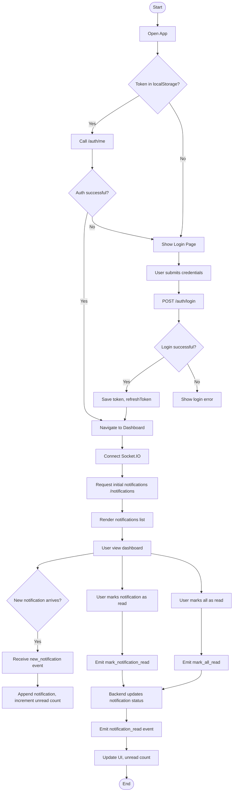

# Notification System BPMN

Файл BPMN сохранён как `notification-system.bpmn`.

## Процесс

```mermaid
flowchart TD
  Start([Start]) --> A[Open App]
  A --> B{Token in localStorage?}
  B -- Yes --> C[Call /auth/me]
  B -- No --> D[Show Login Page]
  C --> E{Auth successful?}
  E -- Yes --> F[Navigate to Dashboard]
  E -- No --> D
  D --> G[User submits credentials]
  G --> H[POST /auth/login]
  H --> I{Login successful?}
  I -- Yes --> J[Save token, refreshToken]
  J --> F
  I -- No --> K[Show login error]
  F --> L[Connect Socket.IO]
  L --> M[Request initial notifications /notifications]
  M --> N[Render notifications list]
  N --> O[User view dashboard]
  O --> P{New notification arrives?}
  P -- Yes --> Q[Receive new_notification event]
  Q --> R[Append notification, increment unread count]
  O --> S[User marks notification as read]
  S --> T[Emit mark_notification_read]
  T --> U[Backend updates notification status]
  U --> V[Emit notification_read event]
  V --> W[Update UI, unread count]
  O --> X[User marks all as read]
  X --> Y[Emit mark_all_read]
  Y --> U
  W --> End([End])
```

## Файлы

- `frontend/bpmn/notification-system.bpmn`
- `frontend/bpmn/notification-system-bpmn.md`
